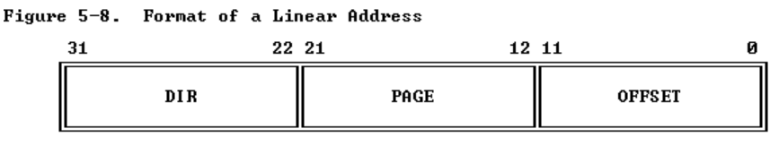
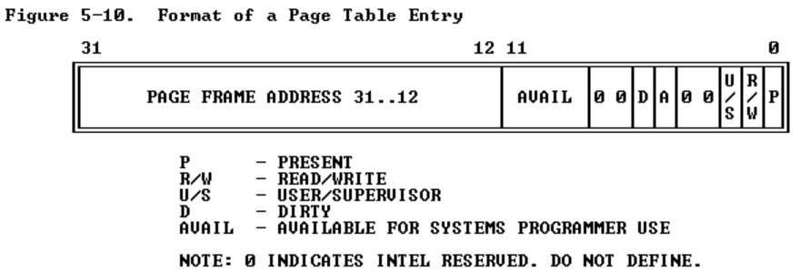

# 实验二
在这个实验中，要写关于操作系统的内存管理的代码，主要包括两个部分：   
1、内核的物理内存分配将内存分段    
2、虚拟内存机制   

新加入的文件有：
* inc/memlayout.h
* kern/pmap.c
* kern/pmap.h
* kern/kclock.h
* kern/kclock.c
memlayout.h描述了虚拟内存空间的布局，你需要修改pmap.c，memlayout.h和pmap.h定义了PageInfo结构体追踪那些page的物理内存是空闲的。kclock.c和kclock.h操作pc的电池时钟和cmos RAM设备，在ram设备中bios记录了PC物理内存的数量。在pmap.c的代码中，为了知道物理内存大小的数量需要阅读设备硬件代码，但是这些代码需要你来完成，你不需要知道cmos硬件如何工作。
## 第一部分：物理内存管理
操作系统需要一直跟踪并了解那块区域的物理RAM是空闲的、那一块区域是正在被使用的，JOS管理物理内存是以页为单位的通过的MMU映射和保护每个分配的内存；  
#### 练习1
    在文件kern/pmap.c，实现下列函数：
    boot_alloc();
    mem_init()
    page_init()
    page_alloc()
    page_free()
    check_page_free_list()与check_page_alloc() 测试你的物理页分配器，你应该启动JOS看是否check_page_alloc报告成功，assert指令会比较有用;

* boot_alloc()与mem_init()  
这个函数只有mem_init()函数中被调用，第一次被调用是创建一级页表，也就是page_dir，一共有4096个字节，也就是最多有1024个二级页表，然后将page_dir的uvpt，就page_dir占有的页设置权限，然后就是mem_init需要补充的部分，其实注释中写的比较清楚，让你分配一共npages大小的结构体数组，npages这个变量在i386_detect_memory函数中被初始化。代码与注释如下，注意此时不能用malloc，因为还没有建立虚拟内存机制
```
//////////////////////////////////////////////////////////////////////
	// Allocate an array of npages 'struct PageInfo's and store it in 'pages'.
	// The kernel uses this array to keep track of physical pages: for
	// each physical page, there is a corresponding struct PageInfo in this
	// array.  'npages' is the number of physical pages in memory.  Use memset
	// to initialize all fields of each struct PageInfo to 0.
	// Your code goes here:
	pages = (struct PageInfo *)boot_alloc(npages * sizeof (struct PageInfo));
	memset(pages, 0, npages * sizeof (struct PageInfo) );
```
```
static void *
boot_alloc(uint32_t n)
{
	static char *nextfree;	// virtual address of next byte of free memory
	char *result;

	// Initialize nextfree if this is the first time.
	// 'end' is a magic symbol automatically generated by the linker,
	// which points to the end of the kernel's bss segment:
	// the first virtual address that the linker did *not* assign
	// to any kernel code or global variables.
	if (!nextfree) {
		extern char end[];
		nextfree = ROUNDUP((char *) end, PGSIZE);
	}

	// Allocate a chunk large enough to hold 'n' bytes, then update
	// nextfree.  Make sure nextfree is kept aligned
	// to a multiple of PGSIZE.
	//
	// LAB 2: Your code here.
	result = nextfree;
	nextfree = ROUNDUP(nextfree + n , PGSIZE);
	if ((int)(nextfree - KERNBASE) > npages * PGSIZE)
		panic("Out of memory\n");
	return result;
}
```

* page_init()   
这个函数用于追踪当前的物理内存使用情况，使用过的内存，记录其引用的个数，对于空闲的内存，将其用链表进行管理。  
```
        // The example code here marks all physical pages as free.
	// However this is not truly the case.  What memory is free?
	//  1) Mark physical page 0 as in use.
	//     This way we preserve the real-mode IDT and BIOS structures
	//     in case we ever need them.  (Currently we don't, but...)
	//  2) The rest of base memory, [PGSIZE, npages_basemem * PGSIZE)
	//     is free.
	//  3) Then comes the IO hole [IOPHYSMEM, EXTPHYSMEM), which must
	//     never be allocated.
	//  4) Then extended memory [EXTPHYSMEM, ...).
	//     Some of it is in use, some is free. Where is the kernel
	//     in physical memory?  Which pages are already in use for
	//     page tables and other data structures?
	//
	// Change the code to reflect this.
	// NB: DO NOT actually touch the physical memory corresponding to
	// free pages!
	
	size_t i;
	//Mark page 0 in use
	pages[0].pp_ref = 1;

	//[PGSIZE, npages_basemem * PGSIZE) is free
	for (i = 1; i < npages_basemem; i++) {
		pages[i].pp_ref = 0;
		pages[i].pp_link = page_free_list;
		page_free_list = &pages[i];
	}
	
	///[IOPHYSMEM, EXTPHYSMEM) set it be allocated 
	for (i = IOPHYSMEM / PGSIZE ; i < EXTPHYSMEM / PGSIZE ; i ++)
		pages[i].pp_ref = 1;

	// boot_alloc Get first free mapped addr in kernel
	physaddr_t kern_free_addr = PADDR(boot_alloc(0));
	for ( ; i < kern_free_addr / PGSIZE ; i ++)
		pages[i].pp_ref = 1;
	
	for (; i < npages; i ++) {
		pages[i].pp_ref = 0;
		pages[i].pp_link = page_free_list;
		page_free_list = &pages[i];
	}
```

* page_alloc()
这个函数就比较容易了，就从链表中取出一个page，并初始化这个page的内容；
```
//
// Allocates a physical page.  If (alloc_flags & ALLOC_ZERO), fills the entire
// returned physical page with '\0' bytes.  Does NOT increment the reference
// count of the page - the caller must do these if necessary (either explicitly
// or via page_insert).
//
// Be sure to set the pp_link field of the allocated page to NULL so
// page_free can check for double-free bugs.
//
// Returns NULL if out of free memory.
//
// Hint: use page2kva and memset
struct PageInfo *
page_alloc(int alloc_flags)
{
	// Fill this function in

	if (page_free_list == NULL)
		return NULL;
	struct PageInfo *pRet;
	pRet = page_free_list;
	page_free_list = pRet->pp_link;
	pRet->pp_link = NULL;

	if (alloc_flags & ALLOC_ZERO){
		void *va = page2kva(pRet);
		memset(va, '\0', PGSIZE);
	}
		 
	return pRet;
}
```
* page_free   
直接将这个page的结构体，加入链表中，首先需要确定该page的页引用是否为0。


```
//
// Return a page to the free list.
// (This function should only be called when pp->pp_ref reaches 0.)
//
void
page_free(struct PageInfo *pp)
{
	// Fill this function in
	// Hint: You may want to panic if pp->pp_ref is nonzero or
	// pp->pp_link is not NULL.
	if (pp->pp_ref != 0 || pp->pp_link != NULL){
		panic("this page's ref not zero or page's pLink is not NULL\n");
		return;
	}
	//pp->pp_ref = 0;
	pp->pp_link = page_free_list;
	page_free_list = pp;

}
```


        

## 第二部分: 虚拟内存
在x86架构中，虚拟内存机制包括段选择器与段内偏移，线性地址是从段转换得到的地址，物理地址是通过页转换得到，在通过硬件总线从RAM进行寻址；  
```
      Selector  +--------------+         +-----------+
          ---------->|              |         |           |
                     | Segmentation |         |  Paging   |
Software             |              |-------->|           |---------->  RAM
            Offset   |  Mechanism   |         | Mechanism |
          ---------->|              |         |           |
                     +--------------+         +-----------+
            Virtual                   Linear                Physical

```
一个C指针是虚拟地址的偏移量，在boot/boot.S中，我们加载了全局描述表，这个表将所有段的基址设置为0，因此段选择器不起作用了，所以虚拟地址恒等于这个偏移量，在lab3中我们会引入分段机制，但是目前可以忽略这个机制。  
在lab1的第三部分，已经实现一个简单的页表，将地址0xf0100000映射到0x00100000，但是只映射了前4MB的内存，现在我们将他扩展到256MB空间，将其映射到以0xf0000000开始的空间，或者其他空间。  
#### 练习3
        通过GDB，我们只能通过虚拟地址来查看内存所存放的内容，但是如果我们能够访问物理内存的话，肯定会更有帮助的。我们可以看一下QEMU中的一些常用指令，特别是xp指令，可以允许我们去访问物理内存地址。
一旦运行保护模式后，所有的内存地址都被解释为虚拟内存地址,没有其他的方法使用线性地址或者是物理地址，所有的地址都被解释为虚拟地址，被MMU进行翻译；如何进行“翻译”如下图

为了区分不一样的地址，在代码中用不同的宏定义加以区分
|C type| Address Type|
|------|-------------|
| T*   |虚拟地址 |
|uintpt_t | 虚拟地址|
|physaddr_t | 物理地址 |

#### 问题
下列代码中x是什么类型的地址？
```
    mystery_t x;
	char* value = return_a_pointer();
	*value = 10;
	x = (mystery_t) value;
```
回答：虚拟地址,也就是uintptr_ t,因为他直接由操作系统进行寻址，是通过MMU进行寻址。  

JOS内核有时需要读取或者修改内存，但是这时有可能他只知道这个要被修改的内存的物理地址。举个例子，当我们想要加入一个新的页表项时，我们需要分配一块物理内存来存放页目录项，然后初始化这块内存。然而，内核，它是不能绕过 虚拟地址转换 这一步的，因而它也不能直接加载或者存储物理地址。那么我们如何把物理地址转换为虚拟地址，我们可以采用KADDR(pa)指令来获取。其中pa指的是物理地址。

同样的，如果想通过虚拟地址的值求得物理地址的值，我们可以采用PADDR(va)指令。

### 引用计数
在之后的实验中，你将会经常遇到一种情况，多个不同的虚拟地址被同时映射到相同的物理页上面。这时我们需要记录一下每一个物理页上存在着多少不同的虚拟地址来引用它，这个值存放在这个物理页的PageInfo结构体的pp_ref成员变量中。当这个值变为0时，这个物理页才可以被释放。通常来说，任意一个物理页p的pp_ref值等于它在所有的页表项中，被位于虚拟地址UTOP之下的虚拟页所映射的次数（UTOP之上的地址范围在启动的时候已经被映射完成了，之后不会被改动）。

　   当我们使用page_alloc函数的时候需要注意。它所返回的页的引用计数值总是0，所以pp_ref应该被马上加一

### 页表管理

#### 练习4
完成kern/pmap.c中的下面几个子函数的编码
        pgdir_walk()  
        boot_map_region()
        page_lookup()
        page_remove()
        page_insert()
　　    check_page()子函数将会被用来检查你所编写的这些程序是否正确。

## 内核地址空间
JOS把32位线性地址虚拟空间划分成两个部分。其中用户环境（进程运行环境）通常占据低地址的那部分，叫用户地址空间。而操作系统内核总是占据高地址的部分，叫内核地址空间。这两个部分的分界线是定义在memlayout.h文件中的一个宏 ULIM。JOS为内核保留了接近256MB的虚拟地址空间。这就可以理解了，为什么在实验1中要给操作系统设计一个高地址的地址空间。如果不这样做，用户环境的地址空间就不够了。

### 权限与隔离
由于内核和用户进程只能访问各自的地址空间，所以我们必须在x86页表中使用访问权限位(Permission Bits)来使用户进程的代码只能访问用户地址空间，而不是内核地址空间。否则用户代码中的一些错误可能会覆写内核中的数据，最终导致内核的崩溃。

处在用户地址空间中的代码不能访问高于ULIM的地址空间，但是内核可以读写这部分空间。而内核和用户对于地址范围[UTOP, ULIM]有着相同的访问权限，那就是可以读取但是不可以写入。这一个部分的地址空间通常被用于把一些只读的内核数据结构暴露给用户地址空间的代码。在UTOP之下的地址范围是给用户进程使用的，用户进程可以访问，修改这部分地址空间的内容。

### 初始化内核地址空间
现在我们要设置一下UTOP（也就是user top）之上的地址空间：这也是整个虚拟地址空间中的内核地址空间部分。inc/memlayout.h文件中已经向你展示了这部分地址空间的布局。你可以使用你刚刚编写的函数来设置这些地址的布局。

#### 练习5
        完善mem_init()函数通过check_kern_pgdir()和check_page_installed_pgdir()函数的检测。

#### 问题
1. 到目前位置页表目录表，有多少个有效的目录项，他们被映射到哪里，完成下列表格；

|Entry | Base Virtual Address | Piont to (logically) |
|------|----------------------|----------------------|
|1023|?|PageTable for top 4MB of physical mem|
|1022|?|?|
|.|.|.|
|.|.|.|
|.|.|.|
|2|0x00800000|?|
|1|0x00400000|?|
|0|0x00000000|[see next question]|

2. 我们已经将用户空间与内核空间映射到同一的地址空间，为什么用户程序不允许修改内核的内存？什么样的机制保护了内核内存？
3. 操作系统的最大映射物理内存有多大，为什么？
4. 如何我们需要用到全部的物理地址，需要额外多大的空间对其进行管理？具体是如何计算的出管理空间大小的？
5. 在系统开始采用虚拟内存机制时，为什么EIP的地址没有出错？

回答：
1. 

2. 用户程序若可以修改内核内存，那么糟糕的程序会直接让操作系统崩溃，所以，需要进行用户态与内核态的隔离；隔离的机制是pageTable Entry中的权限位PTE_U/S进行区分； 如下图所示


3. 看别人都说是UPAGE开始的4Mb，存pageInfo,自己没太捋清楚；

4. 4mb的pageInfo 对应1024个page，对应的页表是4kb * 1024 = 4mb，所以总共是8MB + 4kb；

5. 这个在lab1中已经回答过了，[0 4MB] 和 [0xf0000000 oxf010000000]都被映射到[0 4MB]的空间中，所以EIP的地址不用变化也可以正确找到下一条指令；
